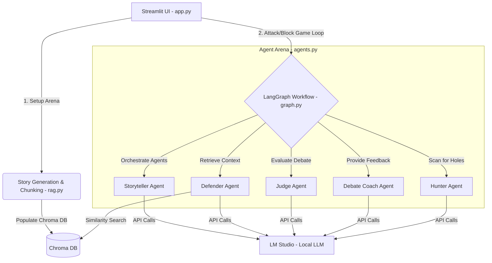

# Make It Make Sense (MIMS) 

An interactive, multi-agent logical debate game where LLM agents and humans challenge each other to find or defend contradictions in stories. Built using **Streamlit**, **LangGraph**, **LangChain**, and **ChromaDB**.

---

## Table of Contents
* [Overview](#-overview)
* [System Architecture](#-system-architecture)
* [Core Features](#-core-features)
* [File Structure](#-file-structure)
* [Installation & Setup](#-installation--setup)
* [How to Play](#-how-to-play)
* [Tech Stack](#-tech-stack)

---

## Overview

**Make It Make Sense (MIMS)** is a logic-verification arena. A **Storyteller** agent writes a story with a hidden, subtle contradiction. The game then proceeds into a debate:
* **The Hunter** tries to point out the contradiction.
* **The Defender** attempts to defend the story (leveraging a local **RAG** vector store containing the story chunks to retrieve evidence) or concedes gracefully if the contradiction is valid.
* **The Judge** evaluates the debate and determines the winner.
* **The Coach** provides actionable logic feedback.

MIMS allows **humans to play either role**—attack as the Hunter or defend as the Defender—against automated AI opponents.

---

## System Architecture

The project orchestrates five AI agents using a state-management pipeline powered by **LangGraph**:



### The Agents & Roles

1. **Storyteller Agent:** Generates cohesive narratives containing a hidden logical contradiction or plot inconsistency.
2. **Hunter Agent:** Scans the text and frames an attack highlighting a potential plot hole.
3. **Defender Agent:** Automatically queries the vector database for relevant story parts to either refute the Hunter or concede if cornered.
4. **Judge Agent:** Evaluates the claims, assigns a logical score (0-10), and declares the round's winner.
5. **Debate Coach Agent:** Analyzes the round and writes a single sentence of encouragement/constructive tips to the human participant.

---

## Core Features

* **Dual Play Modes:**
  * **Hunter Mode:** You attack the story; the AI Defender searches its knowledge base to block you.
  * **Defender Mode:** The AI Hunter attacks; you write the defense based on story events.
* **Local RAG Integration:** Automatically chunks and indexes the active narrative into a local **Chroma DB** using Sentence Transformer embeddings (`all-MiniLM-L6-v2`).
* **Multi-Language Arena:** Fully supports debate prompts, story generation, and coaching responses in **English, Tamil, Tanglish, Spanish, French, German, and Japanese**.
* **Neo-Brutalist UI:** A retro, bold high-contrast design containing custom cards, distinct badges, and interactive "Hover to Reveal" blur filters to keep the Judge's verdict a surprise until you're ready.
* **Local LLM Execution:** Out-of-the-box support for hosting local models (e.g., Google Gemma via LM Studio).

---

## File Structure

* **`app.py`**: Streamlit frontend layout, Neo-brutalist styling rules, and user interaction wrappers.
* **`graph.py`**: Orchestrates state workflows (`DebateState`) and graph compiles using LangGraph.
* **`agents.py`**: Houses agent prompt templates and chain executions.
* **`rag.py`**: Handles text chunking, collection reset, and Chroma similarity queries.
* **`llm_config.py`**: Declares API configuration for connecting to local models.
* **`requirements.txt`**: Python dependencies list.

---

## Installation & Setup

### 1. Model Hosting (LM Studio)
The application expects an OpenAI-compatible server running locally.
1. Download and open **LM Studio**.
2. Download and load a model (e.g., `google/gemma-4-e4b` or similar).
3. Start the local server on Port `1234`.

*(Note: If using a different model or port, modify config values inside [llm_config.py](file:///Volumes/Personal/NLP_Project/llm_config.py).)*

### 2. Environment Setup
Clone or navigate to the project directory, then run:

```bash
# Create and activate virtual environment
python -m venv .venv
source .venv/bin/activate

# Install required packages
pip install -r requirements.txt
```

### 3. Run the App
```bash
streamlit run app.py
```

---

## How to Play

1. **Select Language & Source:** Choose your language and choose whether to generate a story from a prompt or supply your own custom story text.
2. **Choose Role:** Select either **Hunter** or **Defender**.
3. **Drop In:** Click **Drop In & Start** to compile the arena.
4. **Submit Debate Claims/Defenses:**
   * In **Hunter** mode, type your logical attack and hit **Launch Attack**.
   * In **Defender** mode, review the AI's attack claim, formulate a reply, and click **Block Attack**.
5. **Inspect the Verdict:** Hover over the blurred card on the right side to reveal the Judge's evaluation score, reason, and Coach feedback!
